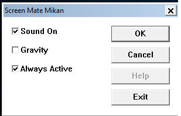

Allows the old "Orange" screenmate from the Windows 95/98/xp era to run on modern windows 7/8/10/11. 
 
All the animations and sounds function! You can bring back that classic laugh! 
 
To exit app simply catch the orange and double click on him, you can turn off the sound. or mute him, and control gravity. 
 
 
Installation: 
With MSI file. 
Run the .MSI installed. 
Install to C:\Program Files\ 
Must install into "Program Files" not (x86) for the start menu shortcut to function. 
 
Manual: 
Download source code 
Make new folder called "Orange" in "Program Files" 
Paste source into Orange folder. 
 
If you install to any other folder you will need to edit the start menu shortcut to point to the new location. 
You will also need to edit the "Orange.bet" file to point to the folder you installed to. 
 

